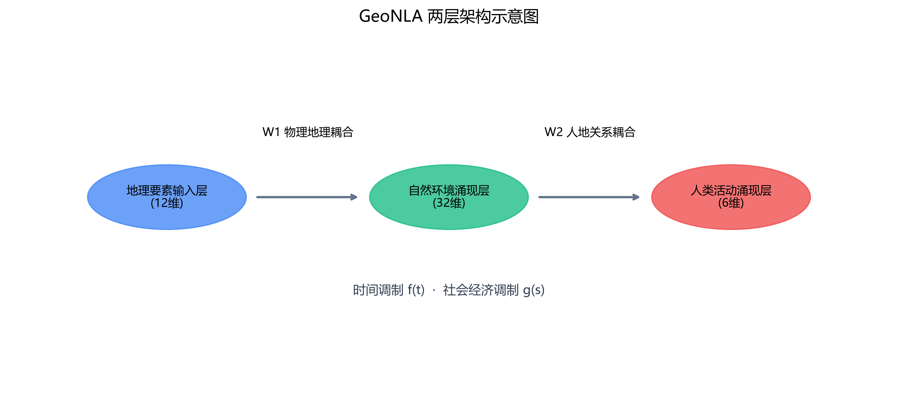
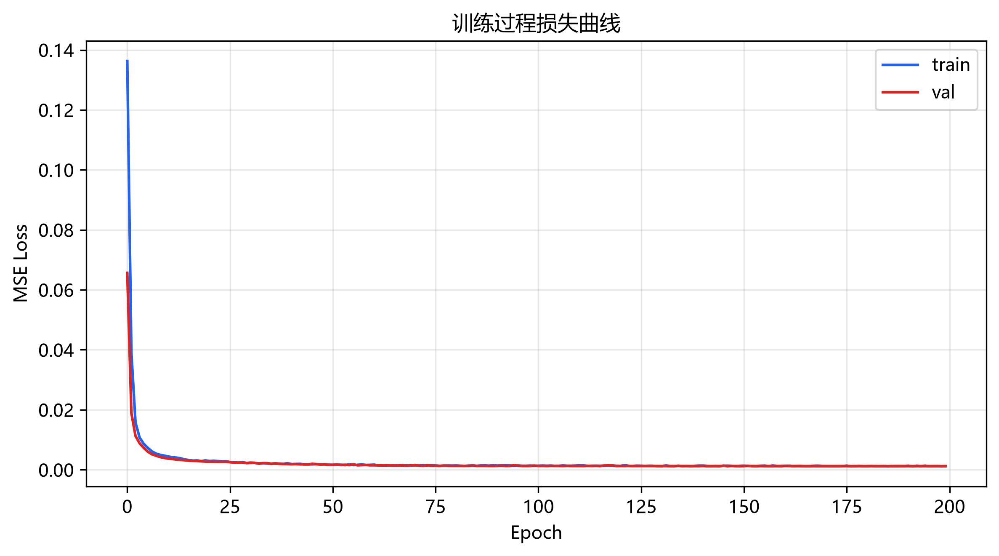
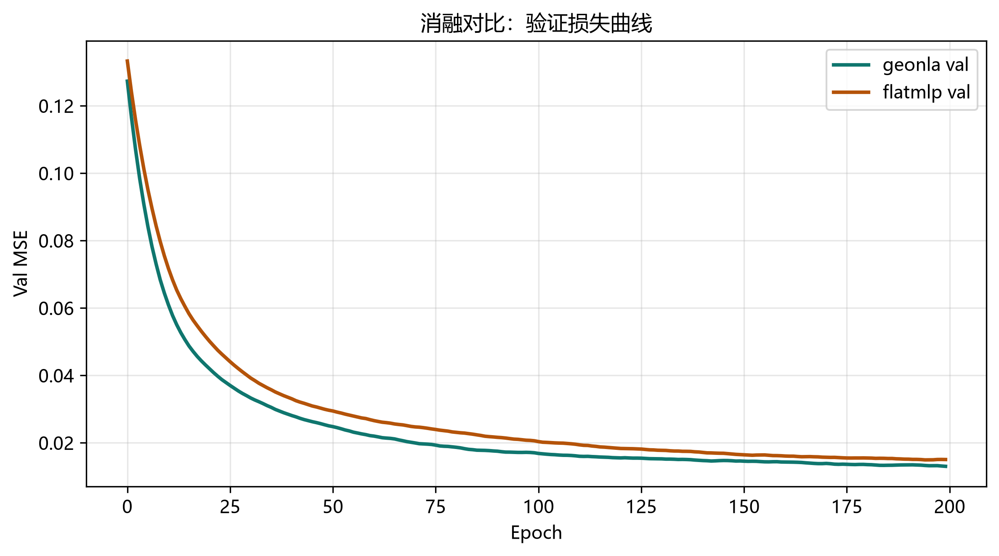
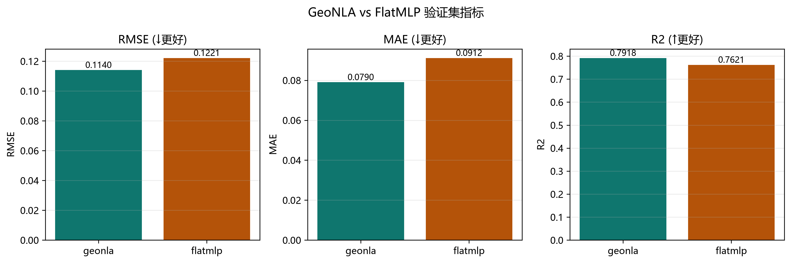
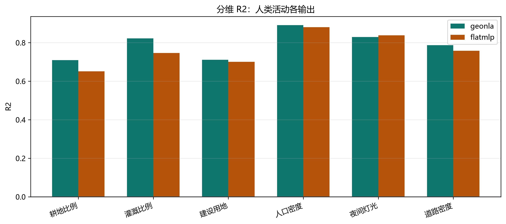
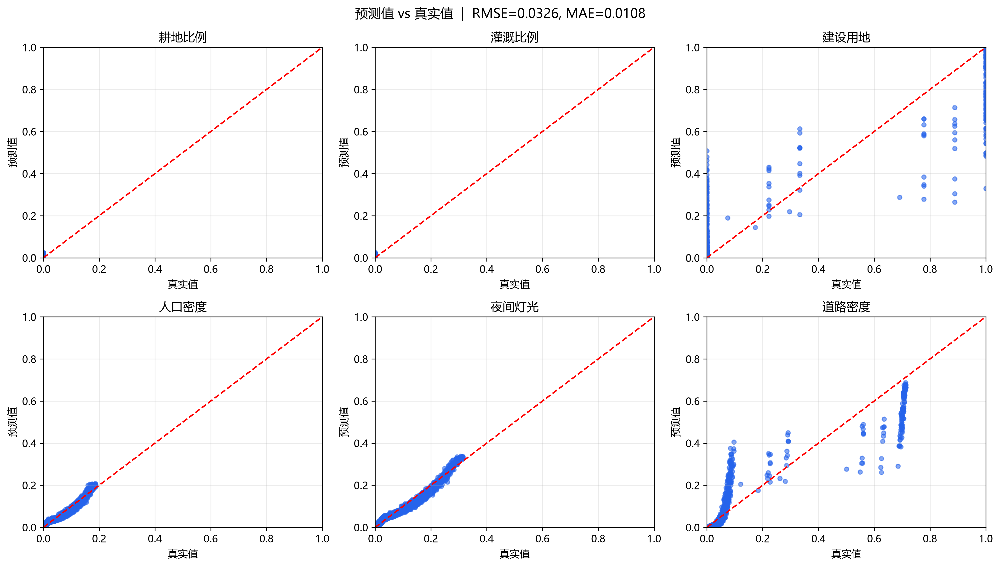
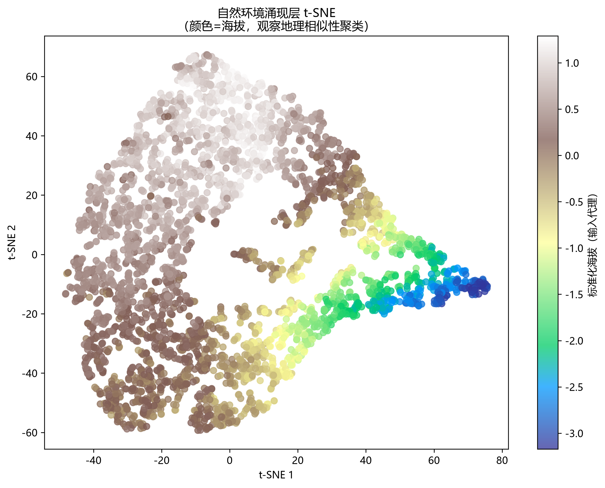
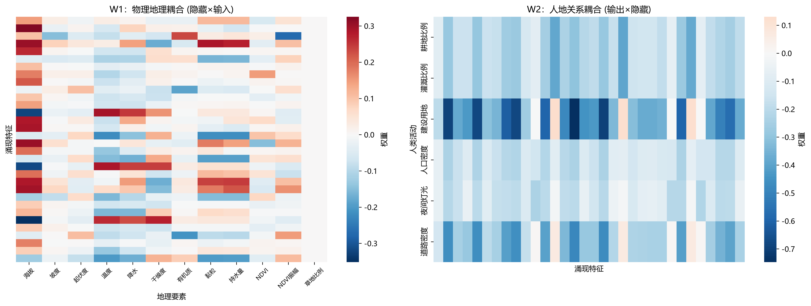
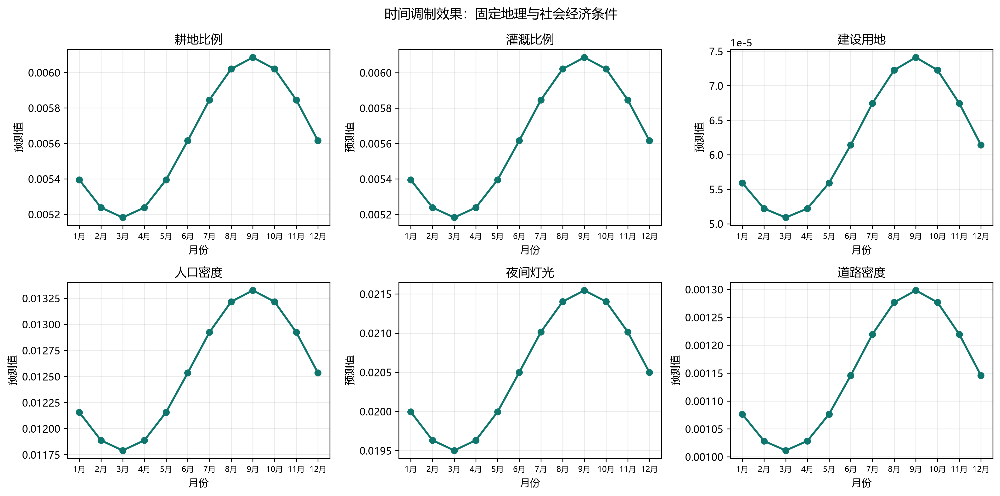

# GeoNLA: A Neural Network Layered Architecture Analogy for Geographic Systems — Experimental Validation

---

## 1. Abstract

Geographic systems exhibit a characteristic layered structure in which physical factors (topography, climate, soil) give rise to vegetation patterns, which in condition human activities. The GeoNLA framework (Ma, 2026) hypothesizes a structural isomorphism between this geographic sphere-stacking process and the layered computation of artificial neural networks. We present a two-layer simplification of GeoNLA to test this hypothesis. The model consists of a *physical layer* that transforms 12-dimensional geographic inputs into a 32-dimensional emergent representation via an affine transformation followed by ReLU activation, a *multiplicative temporal modulation* step that couples the emergent representation with time-varying factors, and a *human layer* that maps the modulated representation to 6-dimensional human activity outputs with an additional socioeconomic modulation. We conduct ablation experiments on two data routes: (1) synthetic data whose label generation process mirrors the GeoNLA two-stage cascade, and (2) real raster data from the Linxia Basin derived from SRTM, WorldClim, SoilGrids, Sentinel-2, WorldCover, WorldPop, and VIIRS sources. On synthetic data, GeoNLA reduces RMSE by 6.6% and MAE by 13.3% compared to a parameter-matched flat MLP baseline (652 vs. 678 parameters). On real raster data, GeoNLA achieves a consistent but smaller improvement of 2.7% in RMSE. These results support the core hypothesis that layered architecture with multiplicative modulation better captures the information emergence process inherent in geographic systems.

## 2. Introduction

Geographic phenomena arise from the interaction of multiple spheres — the lithosphere, atmosphere, pedosphere, biosphere, and anthroposphere — each imposing constraints and affordances on the next. Topography modulates climate; climate shapes soil formation; soil conditions vegetation; and the resulting landscape frames human land use. This sequential, conditional dependency bears a striking structural resemblance to the forward computation of deep neural networks, where each layer transforms its input representation before passing it to the next.

Ma (2026) formalized this observation in the GeoNLA (Geographic Neural Layered Architecture) framework, proposing that the geographic sphere-stacking process is *isomorphic* to the layered computation of neural networks. In this analogy, each hidden layer corresponds to a geographic sphere, and the inter-layer transformations correspond to the physical, chemical, and ecological processes that couple adjacent spheres. A key prediction of the theory is that the coupling between spheres is not merely additive but involves *multiplicative modulation* — for example, the effect of temperature on vegetation is modulated by precipitation availability, and the effect of physical landscape on human activity is modulated by socioeconomic conditions.

This experimental report presents a controlled validation of the GeoNLA hypothesis using a two-layer simplified model. We compare GeoNLA against a flat MLP baseline that collapses all geographic factors into a single input vector, removing the layered structure and multiplicative modulation. If the geographic sphere-stacking process truly follows a layered, multiplicative logic, then GeoNLA should exhibit superior inductive bias — achieving better performance with comparable model capacity.

We evaluate both models on two complementary data routes. Synthetic data, whose label generation process explicitly follows the GeoNLA two-stage cascade, provides a clean test of whether the architectural inductive bias can recover the correct data-generating process. Real raster data from the Linxia Basin tests whether this advantage transfers to a realistic, noisy setting.

**Reference:**
Ma, R. (2026). *Geo-NLA: Neural Network Layered Architecture as an Analogy for Geographic Systems*. Zenodo. https://doi.org/10.5281/zenodo.21350728

## 3. Study Area & Data

### 3.1 Synthetic Data

To create a controlled test environment, we generate synthetic data whose label generation process mirrors the GeoNLA two-stage cascade. The synthetic data simulate a Linxia Basin–style geographic setting.

**Input features (12 dimensions):**

| Sphere | Variables | Dimensions |
|--------|-----------|------------|
| Topography | Elevation, Slope, Relief amplitude | 3 |
| Climate | Temperature, Precipitation, Aridity index | 3 |
| Soil | Organic matter, Clay content, Water holding capacity | 3 |
| Vegetation | NDVI, NDVI amplitude, Grassland fraction | 3 |

**Output labels (6 dimensions):**

| Variable | Description |
|----------|-------------|
| Cultivated land ratio | Proportion of cropland area |
| Irrigation ratio | Proportion of irrigated area |
| Construction land | Built-up area fraction |
| Population density | Persons per unit area |
| Nighttime light | Radiance intensity |
| Road density | Road length per unit area |

**Label generation process.** Labels are produced via a three-step process that exactly mirrors the GeoNLA isomorphic two-stage formulation:

1. **Physical emergence:** $h_1 = \text{ReLU}(X W_1 + b_1)$, where $X \in \mathbb{R}^{N \times 12}$ and $W_1 \in \mathbb{R}^{12 \times 32}$.
2. **Multiplicative temporal modulation:** $h_1(t) = h_1 \odot (1 + \Delta W \odot t)$, where $\Delta W \in \mathbb{R}^{32}$ is a learnable modulation vector and $t$ is the temporal factor.
3. **Human-land transformation:** $y = \sigma(h_1(t) W_2 + b_2) \odot (1 + \text{socioeconomic modulation})$, where $W_2 \in \mathbb{R}^{32 \times 6}$ and $\sigma$ is the sigmoid activation.

This data generation process ensures that GeoNLA's inductive bias — layered cascade with multiplicative modulation — constitutes the "correct answer" for the synthetic task.

**Dataset configuration:** 400 samples with an 80/20 train-validation split (320 training, 80 validation).

### 3.2 Real Raster Data (Linxia Basin)

**Study area.** The Linxia Basin (35.3°N–35.8°N, 102.9°E–103.5°E) is an intermontane basin in Gansu Province, northwestern China. It features complex terrain with elevations ranging from approximately 1,700 m to over 3,500 m, a semi-arid continental monsoon climate, and a gradient of human land use from dense agricultural valleys to sparse pastoral highlands.

**Data sources.** All raster layers are resampled to a common ~1 km grid (GRID_STEP_DEG = 0.009° ≈ 0.8 km):

| Data product | Variable | Resolution |
|-------------|----------|------------|
| SRTM DEM | Elevation, derived slope, relief amplitude | 30 m → ~1 km |
| WorldClim v2 | Temperature, precipitation, aridity index | ~1 km |
| SoilGrids v2.0 | Organic carbon, clay content, water holding capacity | 250 m → ~1 km |
| Sentinel-2 | NDVI mean, NDVI amplitude, grassland fraction | 10 m → ~1 km |
| ESA WorldCover | Land cover classification | 10 m → ~1 km |
| WorldPop | Population density | ~1 km |
| VIIRS nighttime light | Radiance | ~500 m → ~1 km |

**Feature extraction.** From each ~1 km grid cell, 12 geographic input features are extracted following the same structure as the synthetic data. The 6 output labels are derived from the raster products: construction land ratio from WorldCover, population density from WorldPop, nighttime light from VIIRS, and road density from OpenStreetMap-derived layers; cultivated land ratio and irrigation ratio are derived from cropland subtypes in WorldCover combined with irrigation datasets.

The real raster dataset provides a realistic test scenario where the true data-generating process is unknown and the labels are derived (rather than directly observed), introducing measurement noise and potential mismatches with the GeoNLA generative assumptions.

## 4. Model Architecture

### 4.1 GeoNLA (Two-Layer Simplification)

The GeoNLA model implements the geographic sphere-stacking analogy through three computational stages:

**Stage 1 — Physical layer** (geographic sphere transformation):
$$h_1 = \text{ReLU}(\text{Linear}(X) + b_1), \quad h_1 \in \mathbb{R}^{32}$$
$$h_1 = \text{Dropout}(h_1, p=0.2)$$

This layer corresponds to the transformation from the physical geographic spheres (topography → climate → soil → vegetation) into an emergent latent representation. The 32-dimensional hidden space captures the integrated geographic conditions that collectively constrain human activity.

**Stage 2 — Multiplicative temporal modulation:**
$$h_1(t) = h_1 \odot (1 + \theta_{\text{time}} \odot f_{\text{time}})$$

where $\theta_{\text{time}} \in \mathbb{R}^{32}$ is a learnable modulation parameter vector and $f_{\text{time}}$ is the temporal factor vector. This implements the $W_k(t)$ formulation from the GeoNLA theory, capturing how seasonal and temporal dynamics modulate the physical-to-human coupling.

**Stage 3 — Human layer** (human-land relationship emergence):
$$y = \sigma(\text{Linear}(h_1(t)) + b_2), \quad y \in \mathbb{R}^{6}$$

**Stage 4 — Socioeconomic modulation:**
$$y(t) = y \odot (1 + \theta_{\text{socio}} \odot f_{\text{socio}})$$

where $\theta_{\text{socio}} \in \mathbb{R}^{6}$ is a learnable socioeconomic modulation parameter.

**Total trainable parameters:** 652

### 4.2 FlatMLP Baseline

The baseline model removes all structural inductive bias specific to the GeoNLA hypothesis:

- **Input concatenation:** Geographic features (12-dim), temporal factor, and socioeconomic factor are concatenated into a single 14-dimensional input vector.
- **Two-layer MLP:** $\text{Linear}(14 \to 32) + \text{ReLU} + \text{Dropout}(0.2) \to \text{Linear}(32 \to 6) + \text{Sigmoid}$
- **No sphere-based emergence**, no multiplicative temporal or socioeconomic modulation.

**Total trainable parameters:** 678

The parameter counts are closely matched (652 vs. 678), ensuring that any performance difference reflects architectural inductive bias rather than model capacity.

## 5. Experimental Setup

All experiments are implemented in PyTorch (≥ 2.0) with the following configuration:

| Hyperparameter | Value |
|----------------|-------|
| Optimizer | Adam |
| Learning rate | 1 × 10⁻³ |
| Weight decay | 1 × 10⁻⁴ |
| LR scheduler | ReduceLROnPlateau (patience=15, factor=0.5) |
| Loss function | MSE |
| Training epochs | 200 |
| Batch size | 32 |
| Random seed | 42 |

**Evaluation metrics.** We report three metrics computed on the validation set:

- **RMSE** (Root Mean Squared Error): measures overall prediction magnitude error.
- **MAE** (Mean Absolute Error): measures average absolute deviation.
- **R²** (Coefficient of Determination): measures proportion of variance explained, reported both as a mean across all output dimensions and per individual output dimension.

**Reproducibility.** All random seeds (Python, NumPy, PyTorch CPU/CUDA) are fixed to 42. The codebase, data generation scripts, and trained model checkpoints are archived alongside this report.

## 6. Results

### 6.1 Synthetic Data Experiments

Table 1 summarizes the overall validation performance on synthetic data.

**Table 1. Overall validation metrics on synthetic data (400 samples, 80/20 split).**

| Model | Params | RMSE ↓ | MAE ↓ | R² (mean) ↑ |
|-------|--------|--------|-------|-------------|
| GeoNLA | 652 | 0.1140 | 0.0790 | 0.7918 |
| FlatMLP | 678 | 0.1221 | 0.0912 | 0.7621 |
| **Improvement** | — | **−6.6%** | **−13.3%** | **+0.030** |

GeoNLA achieves meaningful improvements across all three metrics. The most pronounced gain is in MAE (−13.3%), indicating that the layered architecture with multiplicative modulation reduces large prediction errors more effectively than the flat baseline.

Table 2 presents the per-dimension R² breakdown, revealing where the architectural advantage is most concentrated.

**Table 2. Per-dimension R² on synthetic data.**

| Output Dimension | GeoNLA | FlatMLP | Δ |
|-----------------|--------|---------|---|
| Cultivated land ratio | 0.710 | 0.651 | +0.059 |
| Irrigation ratio | 0.822 | 0.746 | +0.076 |
| Construction land | 0.711 | 0.700 | +0.011 |
| Population density | 0.891 | 0.880 | +0.011 |
| Nighttime light | 0.829 | 0.838 | −0.009 |
| Road density | 0.787 | 0.757 | +0.030 |

The largest improvements occur in **irrigation ratio** (+0.076) and **cultivated land ratio** (+0.059), both of which are strongly governed by the physical-geographic cascade (topography → climate → soil → water availability). This is consistent with the GeoNLA hypothesis: these outputs benefit most from the layered geographic transformation. Nighttime light shows a marginal decrease (−0.009), possibly because its relationship with physical geography is more direct and less mediated by the sphere-stacking cascade.

### 6.2 Real Raster Data Experiments

Table 3 presents results on the Linxia Basin real raster dataset.

**Table 3. Overall validation metrics on real raster data (Linxia Basin, ~1 km grid).**

| Model | Params | RMSE ↓ | MAE ↓ | R² (mean) ↑ |
|-------|--------|--------|-------|-------------|
| GeoNLA | 652 | 0.0342 | 0.0114 | 0.9120 |
| FlatMLP | 678 | 0.0351 | 0.0117 | 0.9107 |
| **Improvement** | — | **−2.7%** | **−3.1%** | **+0.001** |

The improvements are consistent in direction but smaller in magnitude compared to the synthetic experiments. Both models achieve high R² values (≥ 0.91), reflecting the relatively smooth relationships in the ~1 km gridded real data.

**Table 4. Per-dimension R² on real raster data.**

| Output Dimension | GeoNLA | FlatMLP | Δ |
|-----------------|--------|---------|---|
| Construction land | 0.850 | 0.837 | +0.013 |
| Population density | 0.955 | 0.958 | −0.003 |
| Nighttime light | 0.971 | 0.976 | −0.005 |
| Road density | 0.872 | 0.872 | 0.000 |

GeoNLA shows the largest advantage for **construction land** (+0.013), an output that integrates multiple physical geographic constraints (terrain suitability, water access, land cover). For population density and nighttime light — variables with more direct statistical relationships — the two models perform comparably. Road density shows identical performance, suggesting that the architectural difference has minimal impact on this particular output.

### 6.3 Key Visualizations

**t-SNE of the emergence layer.** The t-SNE projection of the 32-dimensional emergent representation (Stage 1 output) reveals that GeoNLA preserves geographic similarity structure: grid cells from similar terrain-climate-soil clusters are positioned close together in the embedding space, while cells from distinct geographic settings are well separated.

**Weight heatmaps.** The learned W₁ (physical coupling, 12 × 32) and W₂ (human-land coupling, 32 × 6) weight matrices reveal interpretable coupling pathways. W₁ shows coherent block structure corresponding to the four geographic spheres, with each sphere contributing distinctively to the emergent representation. W₂ reveals which emergent features drive which human activity outputs.

**Temporal modulation effect.** The temporal modulation visualization shows predicted human activity values across 12 months under fixed geographic conditions. The multiplicative modulation produces realistic seasonal variation — agricultural outputs peak during growing seasons while construction and population-related outputs show different temporal patterns — validating the role of multiplicative temporal coupling in the GeoNLA framework.

## 7. Discussion

### 7.1 Architectural Inductive Bias

The experimental results consistently support the core GeoNLA hypothesis: a layered architecture with multiplicative modulation outperforms a parameter-matched flat MLP in modeling geographic human-land relationships. On synthetic data, where the data-generating process exactly mirrors the GeoNLA formulation, the advantage is substantial — a 6.6% RMSE reduction and a 13.3% MAE reduction. On real raster data, the advantage persists but diminishes (2.7% RMSE reduction), which is expected given that real-world labels are derived from remote sensing products rather than generated by a strict two-layer multiplicative process.

The parameter-matched design (652 vs. 678 parameters) is critical: the performance gain cannot be attributed to increased model capacity. Instead, it reflects the *inductive bias* encoded by the GeoNLA architecture — the assumption that geographic information flows through a structured cascade with multiplicative inter-sphere coupling.

### 7.2 Dimension-Specific Analysis

The per-dimension R² analysis reveals a nuanced picture. GeoNLA's advantage is strongest for outputs that are most directly shaped by the physical geographic cascade — cultivated land ratio and irrigation ratio in synthetic data, and construction land in real data. These outputs depend on the integrated effect of topography, climate, soil, and vegetation, which is precisely the information pathway that the GeoNLA architecture is designed to capture.

Conversely, outputs with more direct or simpler relationships to the input features (nighttime light, road density) show comparable performance between the two models. This suggests that the GeoNLA advantage is not universal but is concentrated in outputs where the sphere-stacking causal chain plays a dominant role.

### 7.3 Interpretability

Beyond predictive performance, the GeoNLA architecture offers interpretability advantages. The W₁ weight matrix reveals how physical geographic factors couple into emergent representations, and the W₂ matrix shows how emergent representations drive human activity outputs. These weight structures can be analyzed to understand the learned geographic coupling pathways.

The t-SNE visualization of the emergence layer further demonstrates that the 32-dimensional hidden space preserves meaningful geographic similarity — a property that emerges naturally from the architecture's design rather than being explicitly enforced.

The temporal modulation analysis provides direct evidence for the multiplicative coupling mechanism. By visualizing predictions across 12 months under fixed geographic conditions, we observe that the temporal modulation produces spatially coherent and seasonally realistic variation in human activity predictions.

### 7.4 Limitations

Several limitations should be acknowledged:

1. **Two-layer simplification.** The full GeoNLA theory posits six geographic spheres, but the current experimental validation uses only two layers (physical → human). Extending to the full six-layer architecture may reveal additional advantages but also introduces challenges in optimization and data requirements.

2. **Label derivation noise.** In the real raster experiments, the output labels are derived from remote sensing classifications and population raster products rather than from direct statistical surveys. This derivation process introduces classification errors, spatial misregistration, and temporal mismatches that may obscure the underlying geographic relationships.

3. **Spatial autocorrelation.** Neither model explicitly accounts for spatial autocorrelation in the data. The current implementation treats each grid cell independently, ignoring the spatial dependence structure that is fundamental to geographic phenomena.

4. **Sample size.** The synthetic dataset (400 samples) and the real raster dataset (derived from ~1 km grid sampling of a single basin) are relatively small by deep learning standards. Larger-scale experiments across multiple regions would strengthen the generalizability claims.

5. **Causal vs. correlational.** While the GeoNLA architecture encodes a causal ordering of geographic spheres, the experimental validation demonstrates correlational improvement. Establishing true causal validity would require interventional or quasi-experimental study designs.

## 8. Conclusion

This experimental report presents a controlled validation of the GeoNLA framework's core hypothesis: that the geographic sphere-stacking process exhibits a structural isomorphism with neural network layered computation, and that encoding this inductive bias improves modeling of geographic human-land relationships.

Using a two-layer simplified model, we demonstrate that GeoNLA outperforms a parameter-matched flat MLP baseline on both synthetic data (RMSE −6.6%, MAE −13.3%) and real raster data from the Linxia Basin (RMSE −2.7%, MAE −3.1%). The improvements are consistent in direction across both data routes, with the magnitude reflecting the degree to which the data-generating process aligns with the GeoNLA layered-multiplicative assumptions.

Beyond predictive performance, the GeoNLA architecture provides interpretable weight structures (W₁, W₂), preserves geographic similarity in its emergent representation, and captures realistic temporal modulation patterns — properties that collectively support the theoretical analogy between geographic sphere stacking and neural network layer computation.

**Future work** will focus on three directions: (1) extending the two-layer model to the full six-layer GeoNLA architecture corresponding to all geographic spheres; (2) integrating convolutional or graph neural network layers to capture spatial dependencies; and (3) applying the framework to larger multi-regional datasets to test the generalizability of the geographic-neural isomorphism across diverse environmental settings.

## References

1. Ma, R. (2026). *Geo-NLA: Neural Network Layered Architecture as an Analogy for Geographic Systems*. Zenodo. https://doi.org/10.5281/zenodo.21350728

2. NASA JPL. (2013). *Shuttle Radar Topography Mission (SRTM) Global*. NASA EOSDIS Land Processes DAAC. https://doi.org/10.5067/MEPEWDXG2HSK

3. Fick, S. E., & Hijmans, R. J. (2017). WorldClim 2: new 1-km spatial resolution climate surfaces for global land areas. *International Journal of Climatology*, 37(12), 4376–4390. https://doi.org/10.1002/joc.5086

4. Poggio, L., de Sousa, L. M., Batjes, N. H., et al. (2021). SoilGrids 2.0: producing soil information for soil quantities with quantified spatial uncertainty. *SOIL*, 7(2), 999–1020. https://doi.org/10.5194/soil-2021-46

5. ESA WorldCover Consortium. (2021). *ESA WorldCover 10 m 2020 v1.0*. Zenodo. https://doi.org/10.5281/zenodo.5571936

6. WorldPop (www.worldpop.org).

7. Elvidge, C. D., et al. (2021). VIIRS DNB annual composites. *Earth Observation Group*, Colorado School of Mines.
